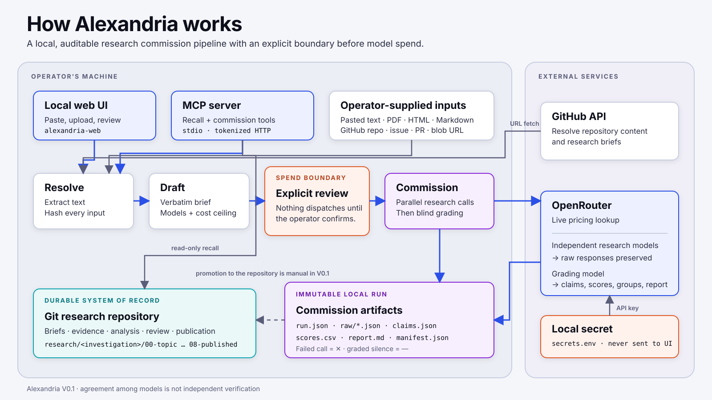
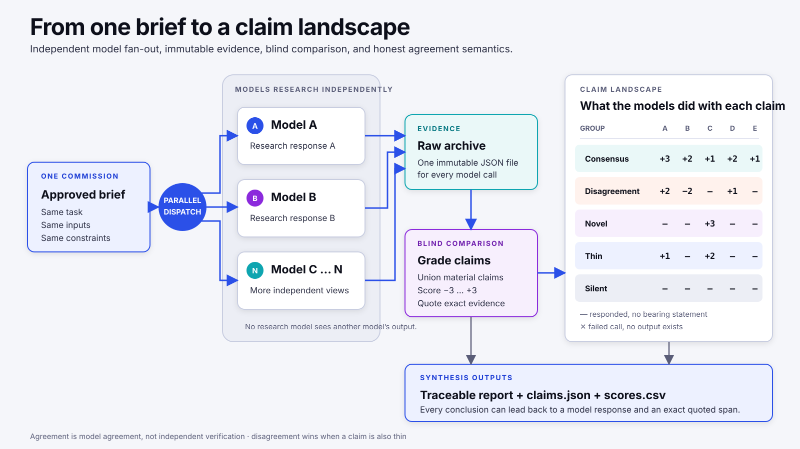

# Alexandria Design

Alexandria is version control for research.

Its purpose is not merely to generate reports. It is to make research durable, inspectable, reproducible, and governable across people, models, tools, and time.

## Design thesis

Research should be treated as an engineering discipline. Briefs, prompts, source records, model outputs, claims, analyses, reviews, and publications are first-class artifacts. Each artifact has a lifecycle, provenance, and review history.

## Core principles

1. **Artifacts are primary.** Conversations are transient; reviewed artifacts endure.
2. **Evidence is preserved.** Raw inputs and model outputs are not silently rewritten after merge.
3. **Provenance is mandatory.** Conclusions should be traceable to sources, prompts, runs, models, and reviewers.
4. **Claims are reviewable units.** Synthesis should not obscure which evidence supports which proposition.
5. **Model disagreement is information.** Agreement is not automatically truth, and disagreement should be analyzed rather than averaged away.
6. **Human judgment is explicit.** Approval, adjudication, and unresolved uncertainty must be visible.
7. **Research is reproducible.** A future reviewer should be able to reconstruct how a conclusion was reached.

## System boundaries

The Git repository is the durable system of record. Provider adapters, orchestration services, user interfaces, and analysis engines are replaceable components around it.

Alexandria should avoid rebuilding commodity capabilities when existing tools can satisfy them. The first research project will test this assumption directly and identify where a thin integration layer is preferable to a new platform.

## Architecture

### System flow

The operator can enter through the local web surface or an MCP client. Both paths
reuse the same input-resolution and commission services. The review gate is the
boundary before model spend. The OpenRouter key stays local, raw responses are
preserved, and the web and MCP result surfaces read the resulting run record.

V0.1 stores completed commissions as immutable local run directories. Moving a run
into the Git research lifecycle remains a deliberate operator action rather than an
automatic side effect. A [1600×900 PNG](assets/alexandria-architecture.png) is also
available for publication.

### Model comparison and synthesis

Every research model receives the same approved brief and inputs without seeing
another model's answer. Alexandria keeps each raw response, compares material claims
blindly, assigns integer scores from −3 to +3 with exact supporting quotes, and emits
a traceable report plus `claims.json` and `scores.csv`.

The landscape keeps the honesty semantics visible: `—` means a model responded but
made no bearing statement; `✕` means the call failed and no output exists. Model
agreement is not independent verification, and disagreement takes precedence when a
claim also has thin coverage. A
[1600×900 PNG](assets/alexandria-model-synthesis.png) is available for publication.

## User interfaces

The operative commission-surface contract is [RFC-0005 — The commission surface](ux/RFC-0005-commission-surface.md). Its [interactive prototype](ux/prototype/index.html) demonstrates all five specified screens without implementing the application.

## Research assurance

Bronze, Silver, and Gold describe increasingly rigorous research processes. They are cumulative process requirements, not labels of factual certainty.

- **Bronze:** exploratory mapping and uncertainty identification.
- **Silver:** decision-support research with broader coverage, source auditing, and independent review.
- **Gold:** claim-level verification, adversarial testing, source-lineage review, and expert approval.

## Governance

All substantive changes are made on branches and merged through pull requests. Structural and methodological changes require the same review discipline as research outputs.
